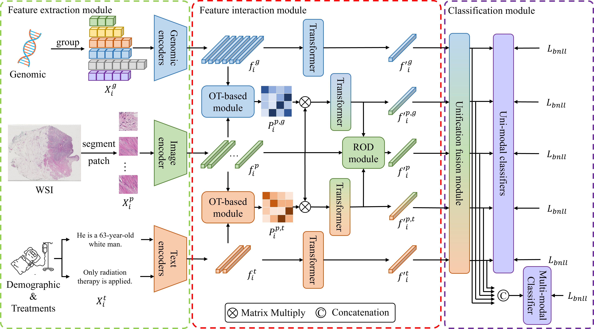

# ICFNet

## Introduction

This is the code of the paper: [TBD]

- A multi-modal survival prediction framework is proposed, incorporating histopathology WSI, genomic expression, demographic information, and treatment;
- A unified module is designed to transform features from diverse modalities into a common latent space;
- A balanced NLLLoss is introduced to ensure the network fairly treat with every patient;
- Our method achieves the SOTA performance among the survival prediction approaches.



## Instruction

### Installation

1. Download the code.

```bash
git clone https://github.com/binging512/ICFNet.git
cd ICFNet
```

2. Create the environment.

```bash
conda create -n icfnet python=3.9
conda activate icfnet
```

3. Install the requirements.

```bash
pip install -r requirements.txt
```

### Prepare the datasets

1. Download the slide from TCGA website: https://portal.gdc.cancer.gov/
2. Use [CLAM](https://github.com/mahmoodlab/CLAM)  to patch and extract features from the WSIs. Note that, WSIs are divided into 256x256 patches at 20x magnification and features are extracted using pretrained ResNet50 model. Then the features are saved as ```.pt``` files for each WSI in one ```pt_files``` folder.
3. (Not necessary) For genomic data, you can use the files we provided. Specifically,  ```tcga_XXXX_all_clean.csv``` is the genomic data, ```signatures.csv``` is the signature file. Or you can download them from [MOTCat](https://github.com/Innse/MOTCat).
4. (Not necessary) For personal data, you can also use the files we provided (```status.json```). Or you can download and re-arrange them from [TCGA](https://portal.gdc.cancer.gov/) website (Clinical data).
5. Please make sure the data files in following structure:

```bash
./data
    ├── BLCA 	             				          		# BLCA dataset
    │    ├── <PATCH_FEAT_DIR>               		        
    │    │    ├── h5_files                  			    # h5 files generated by CLAM (patch coordinates)
    │    │    │    ├── TCGA-2F-A9KO-01Z-00-DX1.195576CF-B739-4BD9-B15B-4A70AE287D3E.h5
    │    │    │    └── ...
    │    │    └── pt_files               					# pt files generated by CLAM (patch features)
    │    │         ├── TCGA-2Z-A9J9-01A-01-TS1.tif
    │    │         └── ...
    │    ├── signatures.csv									# signature files
    │    ├── status_blca.json								# status files
    │    └── tcga_blca_all_clean.csv						# genomic and label file
    ├── BRCA												# BRCA dataset
    │    └── ...
    └── ...													# Other datasets
```

### Training and testing

To train and test ICFNet, please refer the following command. (XXXX refer to the dataset names)

```bash
CUDA_VISIBLE_DEVICES=0 python main.py \
--data_root_dir <PATCH_FEAT_DIR> \
--split_dir tcga_XXXX \
--model_type icfnet \
--bs_micro 16384 \
--ot_impl pot-uot-l2 \
--ot_reg 0.1 \
--ot_tau 0.5 \
--which_splits 5foldcv \
--apply_sig \
--status_path data/XXXX/status_XXXX.json \
--mode coattn_text \
--bag_loss dense_balanced_combine \
--opt adam \
--fusion uni_module \
--max_epochs 20 \
--results_dir ./results
```

For the detailed experiment settings (including the experiments on different datasets and the ablation study), please refer to ```./scripts_final```.

# Acknowledgement

Great thanks to the authors of [MOTCat](https://github.com/Innse/MOTCat) and [CLAM](https://github.com/mahmoodlab/CLAM) for code sharing.

# Citation

```
[TBD]
```

